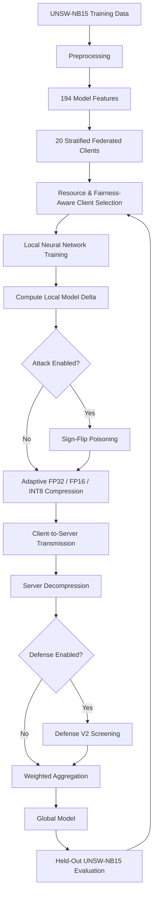

# ACES-FL: Adaptive, Communication-Efficient and Secure Federated Learning for IoT

## MSc Dissertation Research Portfolio

**Research title:** *A Secure and Communication-Efficient Federated Learning Framework for IoT in Resource-Constrained Environments*  
**Framework:** **ACES-FL — Adaptive, Communication-Efficient and Secure Federated Learning**  
**Researcher:** Hope Akpozah Tawiah  
**Programme:** MSc Digital Forensics and Cyber Security  
**Institution:** Ghana Institute of Management and Public Administration (GIMPA), Ghana

---

## Overview

Federated learning enables distributed devices to collaboratively train a machine-learning model without transferring raw training data to a central server. However, practical IoT deployments remain constrained by limited bandwidth, heterogeneous device capabilities, uneven participation, and exposure to malicious model updates.

This research designed, implemented, and evaluated **ACES-FL**, an integrated federated-learning framework for resource-constrained IoT environments. The framework combines:

- **resource-aware client selection**
- **fairness-aware participation**
- **adaptive FP32 / FP16 / INT8 model-delta compression**
- **lightweight malicious-update screening**
- **server-side weighted aggregation**
- **intrusion-detection evaluation using UNSW-NB15**

The work was implemented as an end-to-end proof-of-concept using **Flower, PyTorch, and Ray** across **20 simulated federated clients**.

---

## Key Contributions

### 1. Fairness-Aware Resource Selection

ACES-FL selects **10 of 20 clients per round**.

The final Selection V2 strategy uses:

- **8 resource-score positions**
- **2 fairness-reserve positions**

This preserves communication efficiency while reducing persistent client exclusion.

Selection V2 enabled participation from all 20 clients and improved the Jain participation index from approximately **0.642 to 0.729**.

### 2. Adaptive Communication Compression

Each local model delta is transmitted according to simulated client bandwidth:

| Bandwidth | Representation |
|---|---|
| ≥ 30 Mbps | FP32 |
| 10 to < 30 Mbps | FP16 |
| < 10 Mbps | INT8 |

### 3. Lightweight Model-Integrity Defense

Defense V2 screens decompressed client updates before aggregation using:

- robust update-norm deviation
- coordinate-wise median consensus
- cosine-direction similarity
- recoverable historical trust

---

## Architecture



---

## Experimental Setup

| Component | Configuration |
|---|---|
| Dataset | UNSW-NB15 |
| Training records | 175,341 |
| Test records | 82,332 |
| Model input features | 194 |
| Federated clients | 20 |
| Clients selected per ACES-FL round | 10 |
| Federated rounds | 20 |
| Framework | Flower 1.31.0 |
| ML framework | PyTorch 2.10.0 |
| Simulation runtime | Ray 2.55.1 |
| Model parameters | 33,346 |
| Full FP32 update payload | 133,384 bytes |
| Principal poisoning setting | 20% malicious selected clients |
| Principal sign-flip strength | ×5 |

The compact neural network uses:

`194 → 128 → 64 → 2`

with ReLU activations and 0.20 dropout.

---

## Main Results

### Predictive Performance

| Configuration | Accuracy | Precision | Recall | F1 |
|---|---:|---:|---:|---:|
| FedAvg | 83.29% | 77.58% | 97.97% | 86.59% |
| Selection V1 | 83.30% | 77.62% | 97.91% | 86.59% |
| Selection V2 | 83.29% | 77.61% | 97.90% | 86.58% |
| **ACES-FL + Compression** | **83.56%** | **77.94%** | **97.82%** | **86.76%** |
| Attack without defense | 41.64% | 0.00% | 0.00% | 0.00% |
| Defense V1 | 83.41% | 77.75% | 97.87% | 86.66% |
| **Defense V2** | **83.28%** | **77.61%** | **97.89%** | **86.57%** |

---

## Communication Efficiency

| Configuration | Total Upload | Reduction vs FedAvg |
|---|---:|---:|
| FedAvg | 50.88 MiB | 0.00% |
| Selection V2 | 25.44 MiB | 50.00% |
| **ACES-FL + Compression** | **17.62 MiB** | **65.38%** |
| Defense V2 | 17.62 MiB | 65.38% |

ACES-FL reduced client-to-server model/update tensor traffic from **50.88 MiB to 17.62 MiB**, a **65.38% communication reduction**, while preserving model utility.

---

## Security Evaluation

The principal security experiment used:

- 10 selected clients per round
- 2 malicious clients per round (**20% malicious participation**)
- sign-flip poisoning strength of **×5**

### Attack Impact

Without defense:

- accuracy dropped from **83.56% to 41.64%**
- F1-score dropped from **86.76% to 0.00%**
- loss increased to **26.0413**

### Defense V2

Defense V2 restored:

- **83.28% accuracy**
- **86.57% F1-score**
- **100% malicious-update detection**
- **1.25% false-positive rate**
- **95.24% detection precision**
- **99.00% decision accuracy**

The defense recovered approximately **99.35% of the accuracy lost** under the principal poisoning attack.

---

## Robustness Results

### Different Malicious-Client Ratios

| Malicious Ratio | Accuracy | F1 | Detection Rate | False-Positive Rate |
|---|---:|---:|---:|---:|
| 10% | 82.92% | 86.36% | 100% | 0.00% |
| 20% | 83.28% | 86.57% | 100% | 1.25% |
| 30% | 83.30% | 86.59% | 100% | 0.00% |

### Different Sign-Flip Strengths

| Sign-Flip Scale | Accuracy | F1 | Detection Rate | False-Positive Rate |
|---|---:|---:|---:|---:|
| ×2 | 83.39% | 86.65% | 100% | 0.00% |
| ×5 | 83.28% | 86.57% | 100% | 1.25% |
| ×10 | 83.04% | 86.42% | 100% | 0.00% |

---

## Ablation Findings

- reducing participation from 20 to 10 clients produced a **50% communication reduction**
- Selection V2 improved participation fairness without additional communication cost
- adaptive compression increased total communication reduction to **65.38%**
- efficiency mechanisms did not materially reduce predictive performance
- the security defense was necessary to prevent catastrophic degradation under sign-flip poisoning

---

## Threat Model

The empirical security evaluation focuses on **sign-flip model poisoning**.

A malicious client replaces its clean local model delta with:

```text
malicious_delta = -λ × clean_delta
```

where the principal experiment uses `λ = 5`.

---

## Privacy Scope

Raw UNSW-NB15 training records remain inside simulated client partitions during federated training.

This implementation does **not** claim formal cryptographic privacy and does not implement:

- secure aggregation
- homomorphic encryption
- differential privacy

---

## Limitations

This work is a controlled proof-of-concept rather than a production IoT deployment.

Current limitations include:

- simulated rather than physical IoT devices
- simulated resource profiles for battery, CPU, bandwidth, and connectivity
- one primary benchmark dataset
- security evaluation focused mainly on sign-flip poisoning
- no formal cryptographic privacy mechanism
- no physical fog layer
- no real-device energy, packet-loss, or network-latency measurements
- controlled 20-round experiments rather than large repeated statistical trials

---

## Future Work

- real or emulated resource-constrained IoT hardware
- Edge-IIoTset and CICIoT-style datasets
- repeated multi-seed experiments with confidence intervals
- backdoor and model-replacement attacks
- colluding and adaptive malicious clients
- robust aggregation comparisons
- secure aggregation and differential privacy
- real-device energy and latency measurement
- explainable selection and security-screening decisions

---

## Technology Stack

- Python
- PyTorch
- Flower
- Ray
- NumPy
- Pandas
- Scikit-learn
- UNSW-NB15

---

## Repository Roadmap

```text
secure-federated-learning-iot/
├── README.md
├── requirements.txt
├── data/
│   └── README.md
├── src/
│   ├── client.py
│   ├── server.py
│   ├── model.py
│   ├── preprocessing.py
│   ├── selection.py
│   ├── compression.py
│   ├── attacks.py
│   └── defense.py
├── experiments/
│   ├── baseline/
│   ├── selection/
│   ├── compression/
│   ├── security/
│   ├── robustness/
│   └── ablation/
├── results/
│   ├── metrics/
│   └── figures/
└── docs/
    └── architecture/
```

---

## Author

**Hope Akpozah Tawiah**  
Cybersecurity Researcher | IT Systems & Security Professional | Software Developer

- GitHub: https://github.com/hopetawiah
- LinkedIn: https://linkedin.com/in/hope-tawiah-035175207/

---

## Academic Use

This repository documents MSc dissertation research on ACES-FL. If you reuse code, experimental methodology, architecture, figures, or other research material from this work, please provide appropriate attribution.

A formal citation entry can be added when the dissertation or related publication metadata is finalized.
